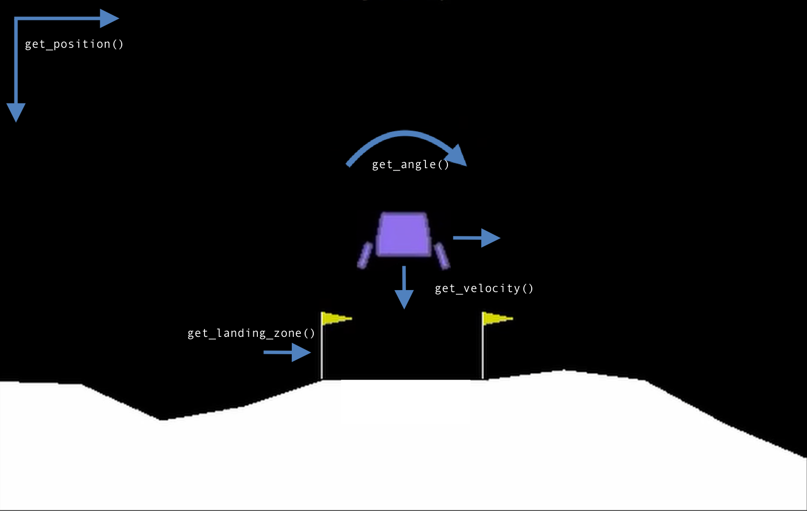

# Lunar Lander Agent
This project implements a reinforcemnt learning agent to interact 
with the Lunar Lander environement. As the name suggests, the task 
is to land a spaceship (agent) on the moon. The environemnt obeys basic 
physics (and gravity). The spaceship can interact with the environment 
using one of its three engine thrusters :
1. main-  acceleration in the negative Y- axis
2. left-  acceleration in the positive X- axis
3. right- acceleration in the negative X- axis


Functions of the environment:
1. get_velocity - returns an array representing the x, y velocity of the lander. Both the x and y velocity are in the range [0,60]
2. get_angle - returns a scalar representing the angle of the lander. The angle is in the range [0,359]
3. get_position - returns an array representing the x, y position of the lander. Both the x and y position of the agent are in the range [0,100]
4. get_landing_zone - returns an array representing the x, y position of the landing zone. Both the x, y coordinates are in the range [1,100]
5. get_fuel - returns a scalar representing the remaining amount of fuel. Fuel starts at 100 and is in range [0,100]

The lander will crash if:

1. it touches the ground when y_velocity < -3 (the downward velocity is greater than three). 
2. it touches the ground when x_velocity < -10 or 10 < x_velocity (horizontal speed is greater than 10).
3. it touches the ground with  5 < angle < 355 (angle differs from vertical by more than 5 degrees).
4. it runs out of fuel 
5. it touches the ground when x_position ∉ landing_zone (it lands outside the landing zone)




## Quick Setup


#### Prerequisites

    * Python >= 3.6

> **NOTICE:** [`pyenv`](https://github.com/pyenv/pyenv) is recommended for python installation.

#### Setting up the project

Set up virtualenv

```sh
$ make virtualenv
$ source venv/bin/activate
```

(You can wipe out virtualenv by running;)

```sh
$ make cleanenv
```

Once project is set, export its PYTHONPATH.

```sh
$ pip install -r requirements.txt
```

#### Development

Install dev-dependencies

```sh
> pip install -r requirements-dev.txt
```

### Notebook

Research steps and the baseline model are described in this [notebook](https://github.com/talmago/salesforce-home-assignment/blob/master/baseline.ipynb).


#### Usage

[Train](https://github.com/talmago/salesforce-home-assignment/blob/master/train.py#L54) the model

```sh
$ python train.py data/gold_data.csv --output-dir .

[2019-10-25 18:19:47,837 - INFO] Loading data
[2019-10-25 18:20:04,914 - INFO] Processing titles
[2019-10-25 18:20:04,979 - INFO] Processing texts
[2019-10-25 18:23:46,784 - INFO] Detecting language codes
[2019-10-25 18:23:50,804 - INFO] dropping non-english content (514 articles)
[2019-10-25 18:23:50,818 - INFO] Training tf-idf bag of words model (Logistic Regression) with 19364 examples
[2019-10-25 18:26:27,097 - INFO] Saving model to ./model.bz2
```

[classify](https://github.com/talmago/salesforce-home-assignment/blob/master/clf.py#L12) an article

```sh
$ ipython

>>> import pandas as pd
>>> sample_idx = 1616   # just a test sample
>>> sample = pd.read_csv('data/gold_data.csv', index_col=0).loc[sample_idx]

>>> from clf import classify
>>> classify(sample['url'], sample['title'], sample['description'], sample['content']))
```

[evaluate](https://github.com/talmago/salesforce-home-assignment/blob/master/clf.py#L60)

```sh
$ ipython

>>> import pandas as pd
>>> df = pd.read_csv('eval.csv', index_col=0)

>>> from clf import evaluate
>>> evaluate(df)
>>> df.to_csv('results.csv')
```

>*Notice*: `eval.csv` should have the same columns as in `gold_data.csv` except the class.
New column (`class`) will be added and output will be saved to `results.csv`.